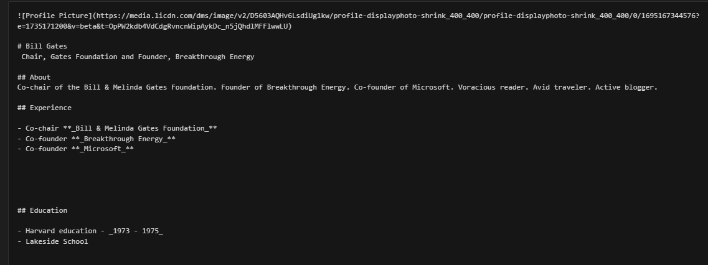

## Welcome to Our Intro Website

We are going to build a Markdown intro website. You might have written plain text documents before, but Markdown helps make your text more organized and easier to consume. Look at the two pieces of text below and think about which is easier to read and more pleasant on the eyes.

<div style="display: flex; align-items: center; justify-content: space-around;">

  

  <strong style=''>vs</strong>


</div>

Here are a few basic Markdown commands to make your text better:

1. **Headings**:
   Use `#`, `##`, `###` for headings.
   # This is a Main Heading
   ## This is a Subheading
   ### This is a Smaller Subheading

2. Bold & Italics:
To make text bold, wrap it with two asterisks: **bold**.
For italic, use one asterisk: *italic*.

    This is **bold** and this is *italic*.

3. Lists:
    Use - or * for unordered lists.
    Use numbers for ordered lists.
    4. First item
    5. Second item
    6. Third item

    - Item 1
    - Item 2
    - Item 3


<br/>
4. Links: To add a link, wrap the text in brackets and the URL in parentheses:

    [Visit our website](https://example.com)

5. Images: Just like you added images above, use the following format for adding images:

    

6. Code Blocks: Use backticks (```) for code blocks.(You will learn more about this later)

```
```html
<h1>This is a heading</h1>
```
```

That's it! With these simple Markdown commands, you can easily create clean, readable documents that are more structured and visually appealing.


Now we can sstart working on the profile website. I made one for bill gates, you can make one for yourselves or someone else. All markdown used for the bill gates profile is either used or shown. Here is just the text part

```text

https://media.licdn.com/dms/image/v2/D5603AQHv6LsdiUg1kw/profile-displayphoto-shrink_400_400/profile-displayphoto-shrink_400_400/0/1695167344576?e=1735171200&v=beta&t=OpPW2kdb4VdCdgRvncnWipAykDc_n5jQhdlMFFlwwLU

Bill Gates
Chair, Gates Foundation and Founder, Breakthrough Energy

About
Co-chair of the Bill & Melinda Gates Foundation. Founder of Breakthrough Energy. Co-founder of Microsoft. Voracious reader. Avid traveler. Active blogger.

Experience

Co-chair **_Bill & Melinda Gates Foundation_**
Co-founder **_Breakthrough Energy_**
Co-founder **_Microsoft_**

Education
Harvard education-1973-1975
Lakeside School

```

Happy Marking !
